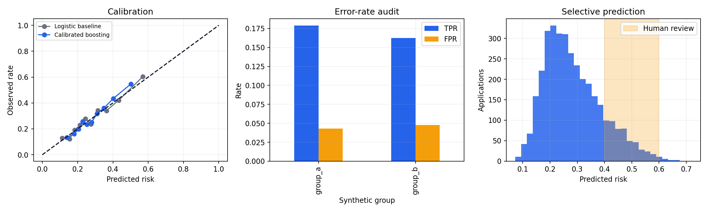
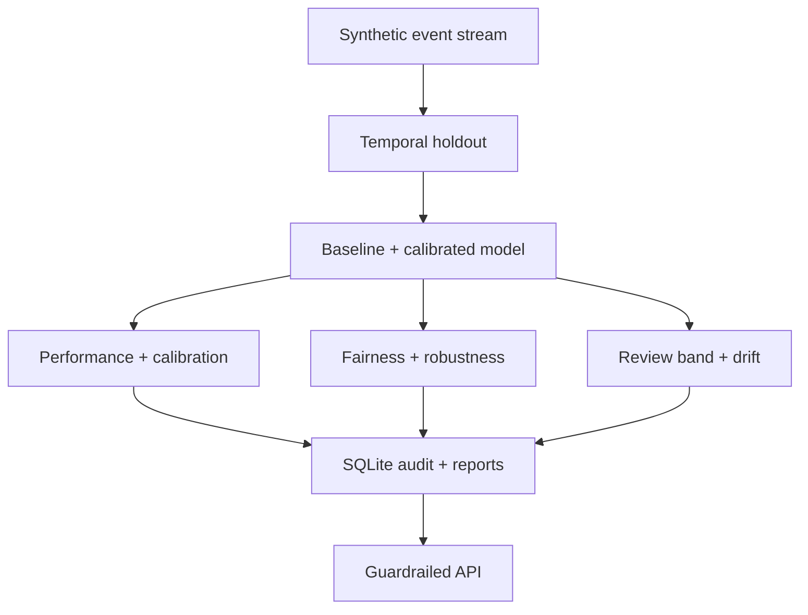

# Trustworthy AI Model Risk Workbench


A substantial, reproducible model-governance portfolio project covering calibration, group fairness, selective prediction, robustness, drift, audit storage, and API guardrails. It uses only synthetic data and is an **independent portfolio simulation**—not a lending product, legal compliance assessment, production deployment, or claim of affiliation.



## Decision problem and professional relevance

A risk score can rank cases well yet remain unsafe: probabilities may be miscalibrated, error rates can differ between groups, uncertain decisions may be over-automated, and data can drift. This workbench turns those concerns into reproducible tests and operational artifacts. It demonstrates Python, pandas, NumPy, scikit-learn, statistical evaluation, SQL, explainability-by-audit, monitoring, API design, CI, Docker, documentation, and responsible-AI judgment for data-science and applied-AI roles in Japan and internationally.

## Architecture



## Trustworthiness controls

| Risk | Control | Evidence |
|---|---|---|
| Temporal leakage | Latest months held out | Explicit split assertion and test |
| Poor probability quality | Sigmoid calibration | Brier, log loss, ECE, calibration plot |
| Unequal errors | Groupwise TPR/FPR audit | CSV, SQLite table, dashboard |
| Automation uncertainty | 0.40–0.60 review band | Coverage, review rate, decided-case error |
| Covariate shift | PSI threshold | Versioned JSON audit output |
| Fragility | Counterfactual perturbation | Mean and p95 score change |
| Unsafe reuse | Data/model cards and API notice | Prominent limitations and non-use statement |

## Data provenance

`src/trustbench/data.py` creates 12,000 fictional events with seed 42. Abstract group labels exist only to exercise audit logic and do not represent real demographics. No personal, private, biometric, company, or scraped data appears anywhere. See [DATA_CARD.md](DATA_CARD.md).

## Methods and evaluation

- standardized logistic-regression baseline versus a calibrated histogram-boosting candidate, with evidence-based model rejection
- untouched chronological holdout; audit group is excluded from training features
- ROC-AUC for ranking and Brier/log loss/ECE for probability quality
- equal-opportunity and false-positive-rate gaps—reported, not presented as proof of fairness
- selective prediction with explicit human-review coverage
- population stability index and counterfactual perturbation sensitivity
- SQLite audit schema, SQL KPI query, FastAPI contract, Docker image, and GitHub Actions

## Reproduced results

<!-- METRICS_START -->
On the 3,500-row temporal holdout, logistic regression achieved **0.683 ROC-AUC**, **0.1865 Brier score**, **0.5559 log loss**, and **0.0076 ECE**. Calibrated boosting was rejected because it was worse: **0.662 ROC-AUC**, **0.1910 Brier**, **0.5666 log loss**, and **0.0144 ECE**. The selected model’s equal-opportunity gap was **1.65 percentage points** and FPR gap was **0.50 points** on abstract synthetic groups; these do not prove real-world fairness. The review policy automated **83.77%** of cases and routed **16.23%** to human review, with a **23.64%** error rate among decided cases. Debt-ratio PSI was **0.035**, below the 0.20 warning threshold. Adding 10,000 synthetic income units changed risk by **0.015 mean absolute probability** and **0.020 at p95**.
<!-- METRICS_END -->

These are synthetic holdout results, not real performance, financial impact, regulatory compliance, or validation for consequential decisions.

## Quickstart

```bash
python -m venv .venv
source .venv/bin/activate  # Windows: .venv\\Scripts\\activate
pip install -e ".[dev]"
python -m trustbench.pipeline
pytest -q
uvicorn trustbench.api:app --app-dir src --reload
```

Generated outputs include `reports/audit_summary.json`, a three-panel dashboard, holdout scores, group audits, and `artifacts/audit.db`. The serialized model is intentionally ignored and rebuilt locally or in CI.

## Limitations, ethics, and operations

Fairness is contextual and cannot be certified from synthetic group gaps. Group labels are deliberately abstract; intersectional analysis is absent. The generator omits selection bias, delayed outcomes, label error, strategic behavior, and appeals. Thresholds and review capacity are policy decisions. Any real system would need domain and legal review, affected-person recourse, human oversight, accessibility, incident response, privacy/security controls, independent validation, monitoring ownership, and controlled experiments. See [MODEL_CARD.md](MODEL_CARD.md).

## License and citation

Code and synthetic data are MIT licensed. Citation metadata is in `CITATION.cff`.
